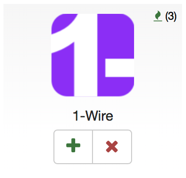
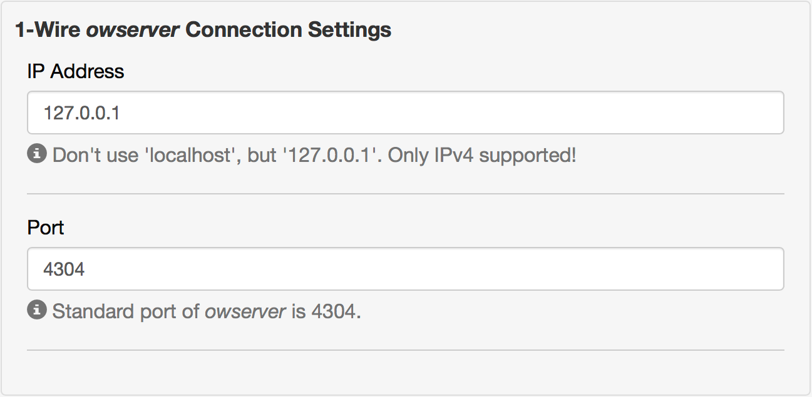

# ow2zw

This App contributes to the *Z-Wave.Me* suite. It is intended to allow the integration of 1-Wire sensors as virtual devices within *Z-Wave.Me*, to be used for home automation e.g. within scenes. It thus bridges between the 1-Wire world and the Z-Wave universe.

## Prerequisite: _owserver_

_ow2zw_ is not able nor intended to control a 1-Wire bus. For that purpose, _ow2zw_ relies on _owserver_, a free software created by Paul Alfille, as part of [OWFS](http://www.owfs.org), the 1-Wire File System.

As explained on it's [manpage](http://owfs.org/index.php?page=owserver):

>owserver (1) is the backend component of the OWFS 1-wire bus control system. owserver (1) arbitrates access to the bus from multiple client processes. The physical bus is usually connected to a serial or USB port, and other processes connect to owserver (1) over network sockets (tcp port). Communication can be local or over a network. Secure tunneling can be implemented using standard techniques.

Therefore you have to ensure that the _owserver_ controlling your 1-Wire Bus is correctly installed and fully operational. Please refer to the [setup](http://owfs.org/index.php?page=setup-2) instructions dedicated to your operating system to ensure this.

Consequentely, as _owserver_ is a *Standard TCP server application*, there's no need that it runs on the same system used as host for *Z-Wave.Me*. As long as the IP:Port _owserver_ is listening at is accessible, _ow2zw_ is able to integrate those devices into *Z-Wave.Me*.

## Caution: Verify that `localhost` is IPv4
*z-way-server*, the technology behind *Z-Wave.Me* and platform of operation for _ow2zw_, is only able to handle IPv4 connections. You thus need to ensure, that _owserver_ listens on an IPv4 address to allow access of _ow2zw_.

This might be a simple task if you define a dedicated address (e.g. `192.168.178.12`). It yet could create an unexpected result - when you operate with `localhost`, which might default to an IPv6 address!

If you're on a *nix system, you can perform the following check (on the system hosting _owserver_) to verify your settings:
> Be aware that `4304` is the default port of _owserver_; you have to alter this if you configured a different port.
```
~ $ nc -zv localhost 4304
nc: connect to localhost port 4304 (tcp) failed: Connection refused
Connection to localhost 4304 port [tcp/*] succeeded!
```
Based on the return message (independent if it fails or succeeds), you can distinguish if `localhost` is IPv4 or IPv6:
- `(tcp)` means IPv6
- `[tcp/*]` means IPv4

If this test indicates that `localhost` defaults to an IPv6 address, you may either alter the default setting for `localhost`, or explicitely use `127.0.0.1` in _owserver_'s configuration file `owfs.conf` - which might be easier.

## Installation
_ow2zw_ is distributed via the _Z.Wave.Me_ app store, in the category _Peripherals_. After installation, you'll find it in the apps directory of your _Z-Wave.Me_ application.
<p  align="center"></p>

## Configuration of a 1-Wire device
To configure a 1-Wire device, add an instance of this app (pressing the `+` - sign) & start to provide the following information.

### 1-Wire _owserver_ Connection Settings
<p  align="center"></p>

|Property|Value|
|:---|:---|
|_IP Address_|The IP address of the _owserver_ you intend to access. Please remember, that it has to be an IPv4 address.|
|_Port_|Port of this _owserver_ as configured in its `owfs.conf`.|

### 1-Wire Sensor Definition


|Property|Value|
|:---|:---|
|_Type_|The (only currently supported) standard sensor type is _Generic Multilevel Sensor_. It can be / should allow to be configured to act as any type of sensor supported by the 1-Wire system. If you select one of the dedicated sensor types, this defines some reasonable default values for subsequent properties.<br>Currently the following dedicated sensor types can be defined: <ul><li>_DS2423_, a counter.</li><li>_DS18B20_, probably the most common 1-Wire temperature sensor.</li></ul>|
|_ID or Alias_|The 1-Wire ID of this sensor. You may use whatever notation you're familiar with.|
|_Data Path_|The data path within the 1-Wire File System to access the sensors data value.|

### Sensor Data Display


### Sensor Data Interpretation


### Advanced Configuration
