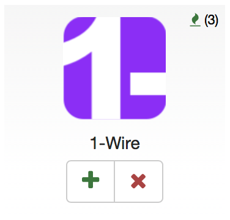
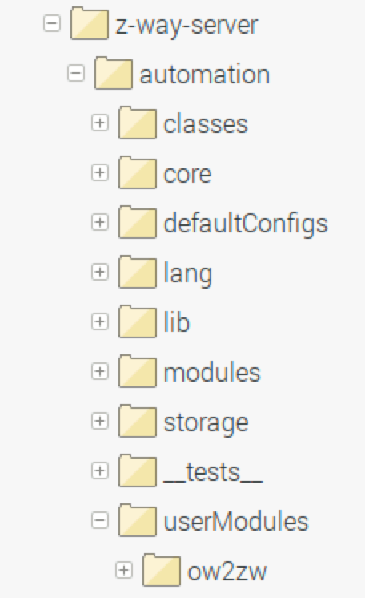
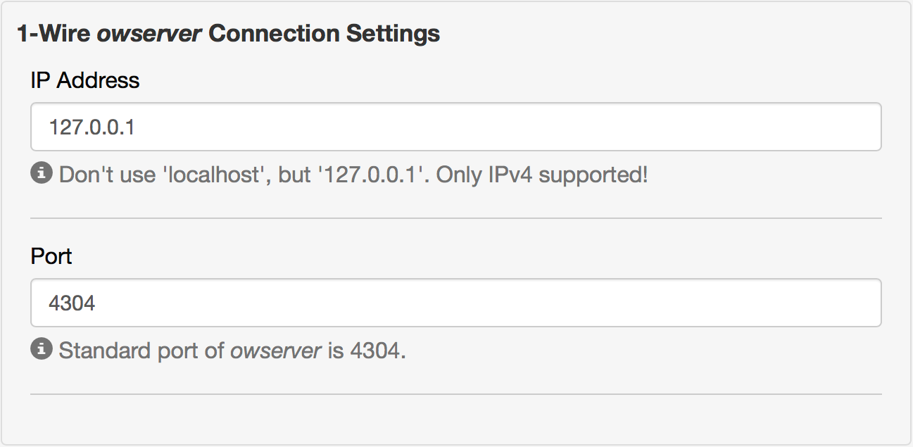
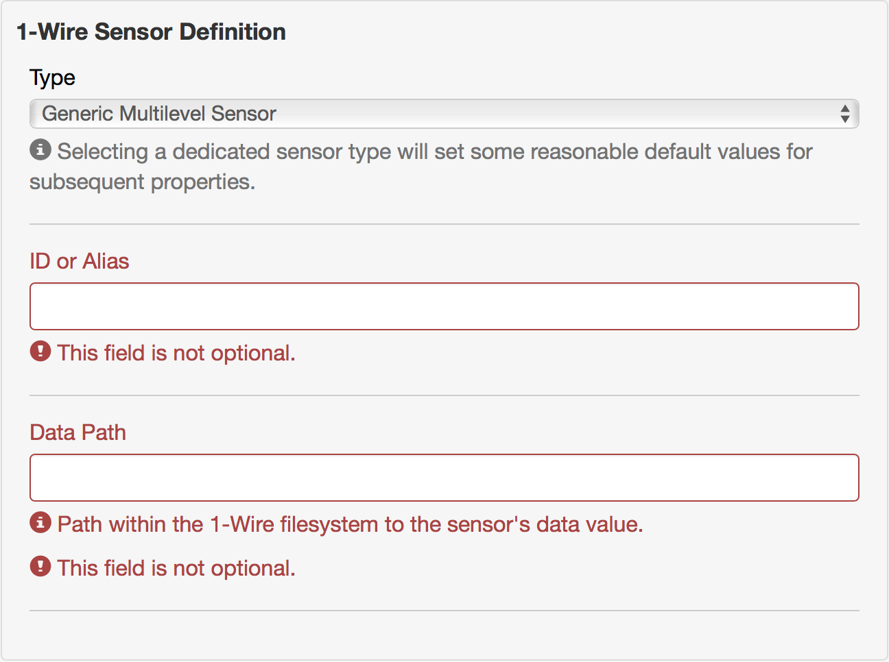
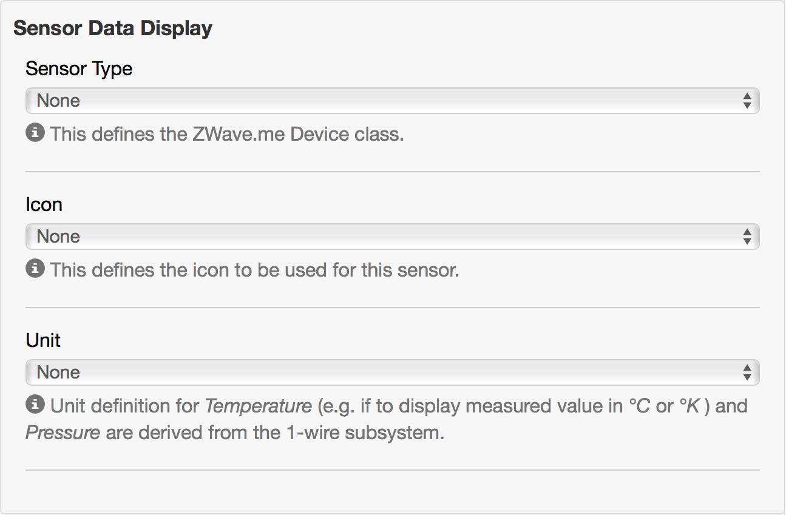
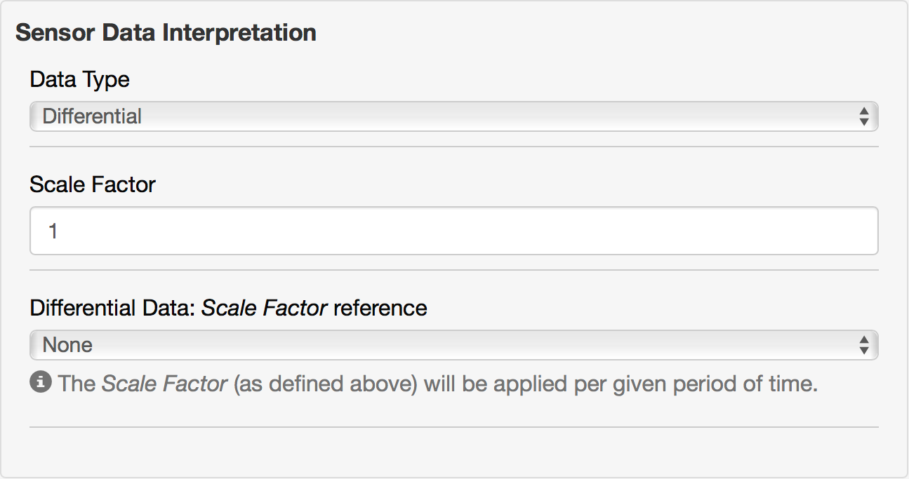
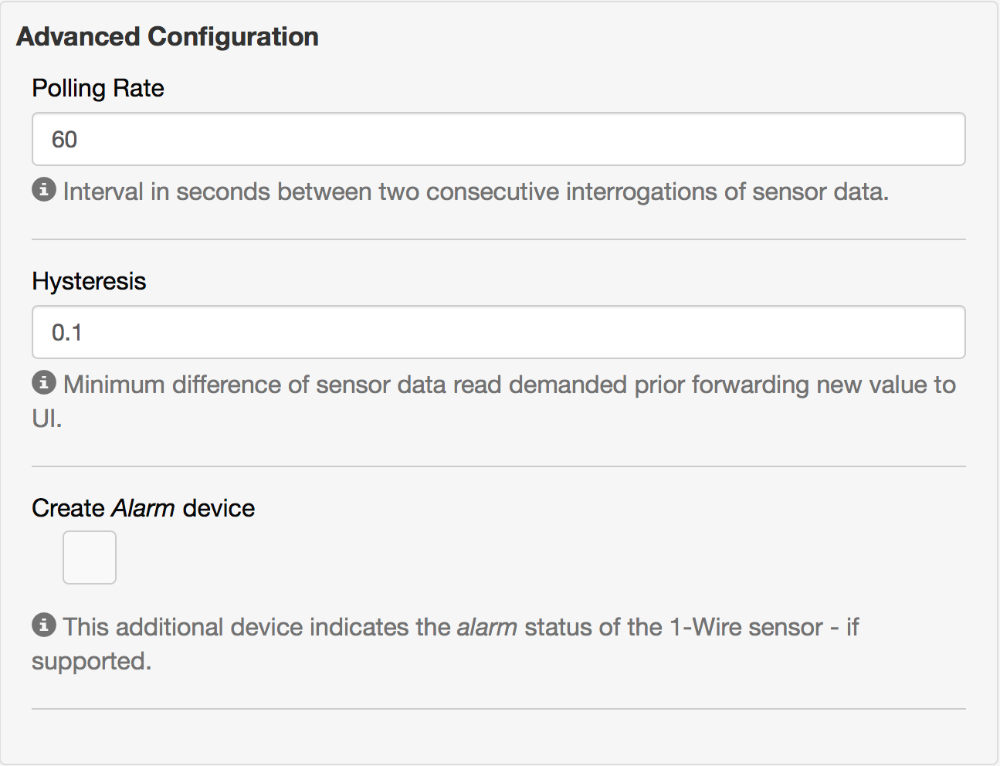

# ow2zw

This App contributes to the *Z-Wave.Me* suite. It is intended to allow the integration of 1-Wire sensors as virtual devices within *Z-Wave.Me*, to be used for home automation e.g. within scenes. It thus bridges between the 1-Wire world and the Z-Wave universe.

[TOC]: #

# Table of Contents
- [Prerequisite: z-way-server 2.3.8 or 3.0](#prerequisite-z-way-server-238-or-30)
- [Prerequisite: _owserver_](#prerequisite-owserver)
- [Caution: Verify that `localhost` is IPv4](#caution-verify-that-localhost-is-ipv4)
- [Installation](#installation)
- [Configuration of a virtual device representing a 1-Wire sensor](#configuration-of-a-virtual-device-representing-a-1-wire-sensor)
    - [1-Wire _owserver_ Connection Settings](#1-wire-owserver-connection-settings)
    - [1-Wire Sensor Definition](#1-wire-sensor-definition)
    - [Sensor Data Display](#sensor-data-display)
    - [Sensor Data Interpretation](#sensor-data-interpretation)
    - [Advanced Configuration](#advanced-configuration)
- [Example of a configuration](#example-of-a-configuration)
- [What's next](#whats-next)

## Prerequisite: z-way-server 2.3.8 or 3.0
Due to a [bug](https://github.com/Z-Wave-Me/home-automation/issues/473) in the current release of Z-Wave.Me v2.3.7 you need to operate (for the time being) with one of the [latest available release candidates](https://storage.z-wave.me/z-way-server/) (e.g. v2.3.8-rc5) to use this app.

## Prerequisite: _owserver_

_ow2zw_ is not able nor intended to control a 1-Wire bus. For that purpose, _ow2zw_ relies on _owserver_, a free software created by Paul Alfille, as part of [OWFS](http://www.owfs.org), the 1-Wire File System.

As explained on it's [manpage](http://owfs.org/index.php?page=owserver):

>owserver (1) is the backend component of the OWFS 1-wire bus control system. owserver (1) arbitrates access to the bus from multiple client processes. The physical bus is usually connected to a serial or USB port, and other processes connect to owserver (1) over network sockets (tcp port). Communication can be local or over a network. Secure tunneling can be implemented using standard techniques.

Therefore you have to ensure that the _owserver_ controlling your 1-Wire Bus is correctly installed and fully operational. Please refer to the [setup](http://owfs.org/index.php?page=setup-2) instructions dedicated to your operating system to ensure this.

Consequentely, as _owserver_ is a *Standard TCP server application*, there's no need that it runs on the same system used as host for *Z-Wave.Me*. As long as the IP:Port _owserver_ is listening at is accessible, _ow2zw_ is able to integrate those devices into *Z-Wave.Me*.

## Caution: Verify that `localhost` is IPv4
*z-way-server*, the technology behind *Z-Wave.Me* and platform of operation for _ow2zw_, is only able to handle IPv4 connections. You thus need to ensure, that _owserver_ listens on an IPv4 address to allow access of _ow2zw_.

This might be a simple task if you define a dedicated address (e.g. `192.168.178.12`). It yet could create an unexpected result - when you operate with `localhost`, which might default to an IPv6 address!

If you're on a *nix system, you can perform the following check (on the system hosting _owserver_) to verify your settings:
> Be aware that `4304` is the default port of _owserver_; you have to alter this if you configured a different port.
```
~ $ nc -zv localhost 4304
nc: connect to localhost port 4304 (tcp) failed: Connection refused
Connection to localhost 4304 port [tcp/*] succeeded!
```
Based on the return message (independent if it fails or succeeds), you can distinguish if `localhost` is IPv4 or IPv6:
- `(tcp)` means IPv6
- `[tcp/*]` means IPv4

If this test indicates that `localhost` defaults to an IPv6 address, you may either alter the default setting for `localhost`, or explicitely use `127.0.0.1` in _owserver_'s configuration file `owfs.conf` - which might be easier.

## Installation
_ow2zw_ is distributed via the _Z-Wave.Me_ app store, in the category _Peripherals_. After installation, you'll find it in the apps directory of your _Z-Wave.Me_ application.
<p  align="center"></p>

Alteratively you could download this repository and drop it's contents under `z-way-server/automation/userModules` in a directory named `ow2zw`.

<p align="center"></p>

Don't forget to restart your server afterwards:
```
sudo service z-way-server restart
```

## Configuration of a virtual device representing a 1-Wire sensor
To create a virtual device to represent a 1-Wire sensor, add an instance of this app (pressing the `+` - sign) & start to provide the following information.

### 1-Wire _owserver_ Connection Settings
This section is necessary to define the network data of the _owserver_ providing access to the 1-Wire File System.

<p  align="center"></p>

|Property|Value|
|:---|:---|
|IP Address|The IP address of the _owserver_ you intend to access. Please remember, that it has to be an IPv4 address.|
|Port|Port of this _owserver_ as configured in its `owfs.conf`.|
<hr>


### 1-Wire Sensor Definition
This section provides basic definitions of the sensor within the 1-Wire File System.

<p  align="center"></p>

|Property|Value|
|:---|:---|
|Type|The (only currently supported) standard sensor type is _Generic Multilevel Sensor_. It can be / should allow to be configured to act as any type of sensor supported by the 1-Wire system. If you select one of the dedicated sensor types, this defines some reasonable default values for subsequent properties.<br>Currently the following dedicated sensor types can be defined: <ul><li>_DS2423_, a counter.</li><li>_DS18B20_, probably the most common 1-Wire temperature sensor.</li></ul>|
|ID or Alias|The 1-Wire ID of this sensor. You may use whatever notation you're familiar with. If you've configured support for [Aliases](http://owfs.org/index.php?page=aliases), you can use those as an alternative to the standard ID.|
|Data Path|The data path within the 1-Wire File System to access the sensors data value.|
<hr>

### Sensor Data Display
The section _Sensor Data Display_ defines the appearance of the virtual device to be created within Z-Wave.Me.

<p  align="center"></p>

|Property|Value|
|:---|:---|
|Sensor Type| Z-Wave.Me internal sensor type definition. You may choose from all multilevel sonsor types supported by Z-Wave.Me.|
|Icon|Select from the list provided the icon that should be used for your virtual device. This list shows all available standard icons.|
|Unit|This defines the unit to display next to the sensors value. For _Temperature_ and _Pressure_, the unit definition is read from the 1-Wire system. You may use _Customized_ to define any other unit label via the property _Customized unit label_.|
|Customized unit label|This property allows to define a customized unit label.<br> Please note that if you define such a label, it is just taken as a piece of text to be displayed next to the sensor value. No validation or any sensor value conversion will be performed.|
<hr>

### Sensor Data Interpretation
The section _Sensor Data Interpretation_ defines the logic for the interpretation or conversion of the 1-Wire sensor data.

<p  align="center"></p>

|Property|Value|
|:---|:---|
|Data Type| If _Absolute_, the raw value as read from the 1-Wire FIle System is used as input value for further interpretation.<br> If _Differential_, the alteration of the value read from the 1-Wire File System at two consecutive events is taken as input value for further interpretation. This logic can be used to calculate alterations over time, e.g. when sensing a speed or a consumption. (The interval between two consecutive read attempts can be defined in the section _Advanced Configuration_.)|
|Scale Factor| Use this property to scale the input value as necessary.|
|Scale Factor Reference| For _Differential_ data interpretation, this propertiy defines the time based reference of the scale factor.
<hr>

### Advanced Configuration
<p  align="center"></p>

|Property|Value|
|:---|:---|
|Polling Rate|This property defines the interval in seconds between two consecutive interrogations of sensor data.|
|Hysteresis|This is the minimum amount of sensor data change necessary to update the UI.|
|Create _Alarm_ device|Some sensors allow the definition of an upper and / or lower threshold (e.g. _min_ - temperature or _max_ - temperature). Normal operation happens within these thresholds. If the sensor reports a value beyond the range of normal operation, an _Alarm_ indication then is created on the 1-Wire Bus. This additional device reports the status of this _Alarm_ indication - if the sensor defined supports this feature.|


## Example of a configuration
How do you use all this properties?

For absolute measuring sensors, it should be straight forward and very simple.  
Here is yet an example for a complex use case:

- You intend to sense the consumation of current of an electric load (e.g. a lamp).
- This consumation is provided as pulsed data; each pulse thus equals a certain amount of consumed current.
- The operation manual of the current meter explains, that each pulse equals 0.5 Wh (perhaps as well given as 2000 pulses per kWh).
- You intend to use a counting sensor to measure the number of pulses over a certain period of time.

When you read the raw sensor data from the 1-Wire File System, you'll (only) get the absolute value of the counter. To convert this into the current consumption, you need to configure the virtual device like this:

- _Data Type_ shall be set to **_Differential_**.
- _Scale Factor_ is **0.5**.
- _Scale Factor Reference_ is **_per Hour_**.
- _Unit_ then is **Custimozed**, **W**.
- Dependend on your consumation, you should alter _Polling Rate_ to a reasonable value, e.g. **600** seconds equals 10 minutes.

## What's next
_ow2zw_ currently has no functionality implemented to perform active operations, like switching a relay. If I'll get a hand on such a device for development purposes, this is definitely something worth to add in the future.

<hr>

Feedback welcome & have fun.